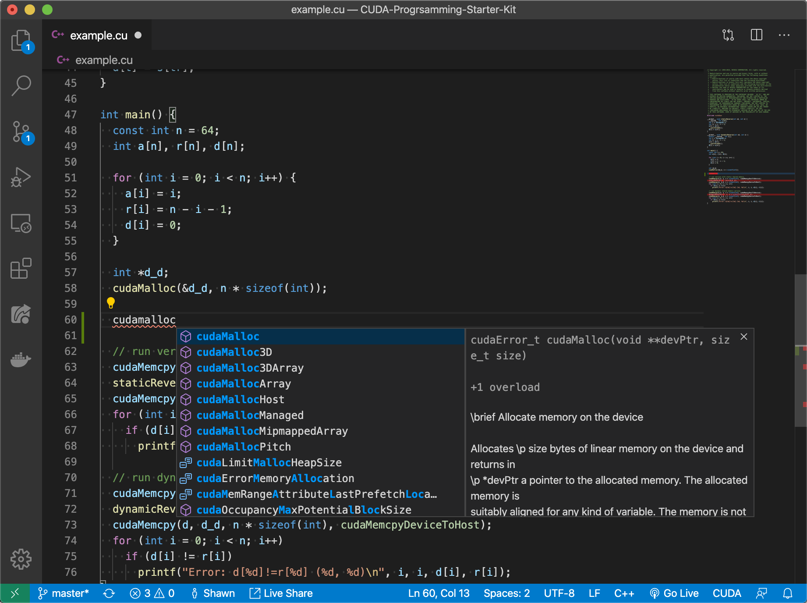
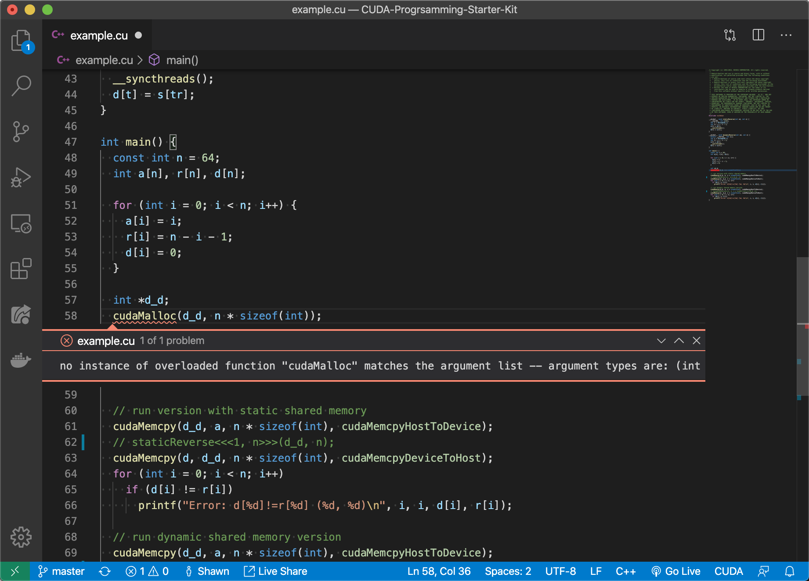
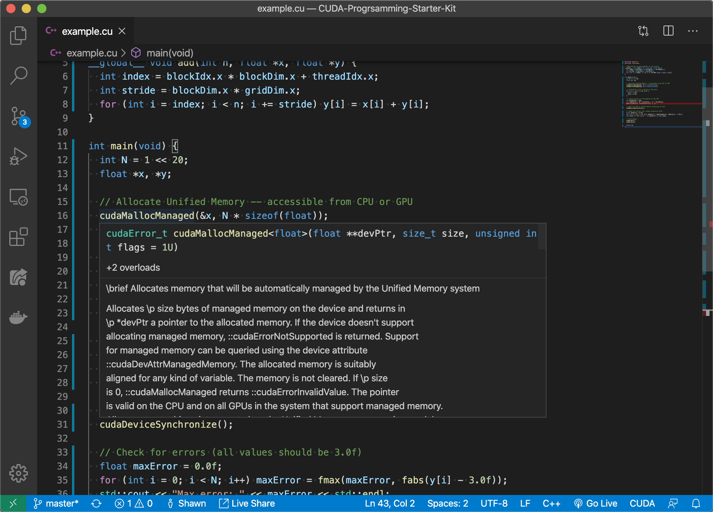
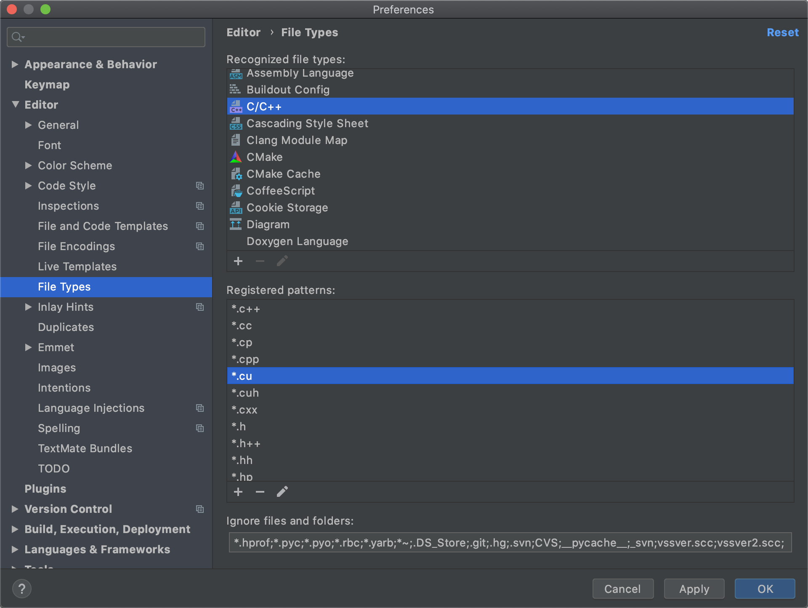
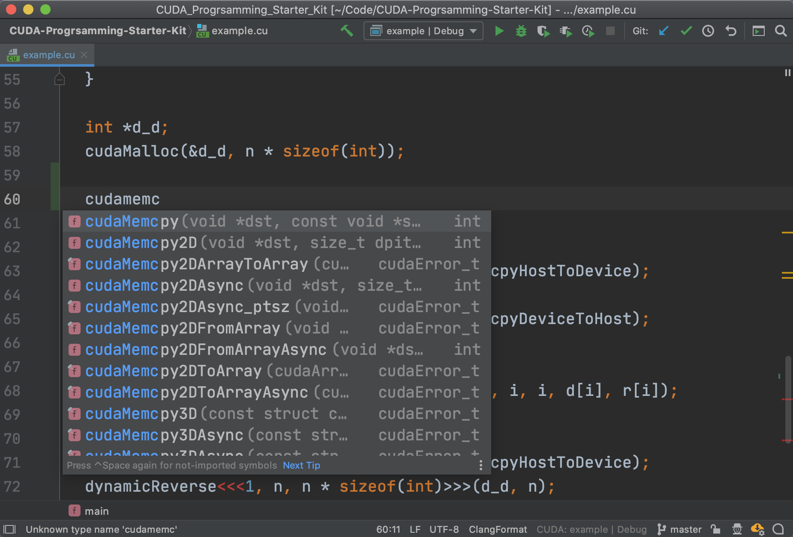
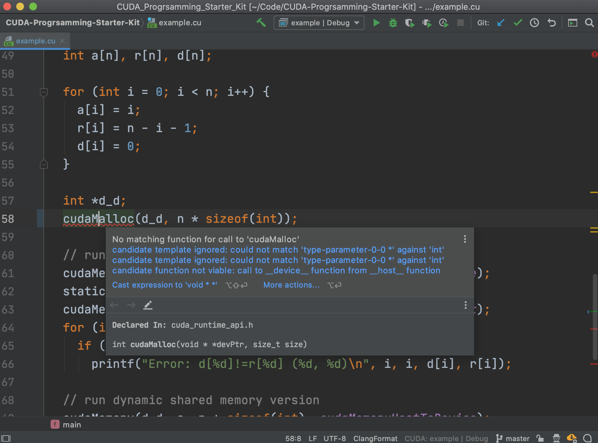
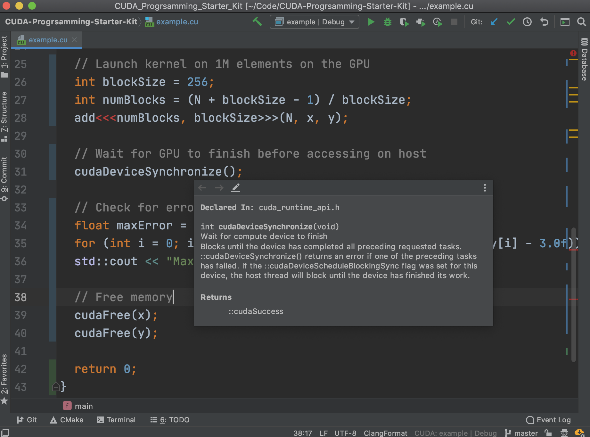

# CUDA Programming Starter Kit

CUDA programming with autocompletion, error-checking, jump-to-definition and quick documentation!

This repo provides basic functionalities for **editing** `*.cu` and `*.cuh` files without the need to install any dependencies (e.g., You don't need to install `nvcc`, `gcc`, `clang`, `msvc`, or any other toolchains). 

If you want to compile, run, and/or debug CUDA programs, please install the CUDA Toolkit from [here](https://developer.nvidia.com/cuda-toolkit).

## VSCode

### Usage

1. Install the C/C++ Plugin https://marketplace.visualstudio.com/items?itemName=ms-vscode.cpptools

2. Clone this repo and open it in VSCode

### Features

- Autocomplete 

    

- Error Checking

    

- Quick Documentation

    

## CLion

### Usage

1. Open the preference and register the file extension `*.cu` and `*.cuh` as C/C++ files

	

2. Clone this repo and open it in CLion

### Features

- Autocomplete 

    

- Error Checking

    

- Quick Documentation

    

